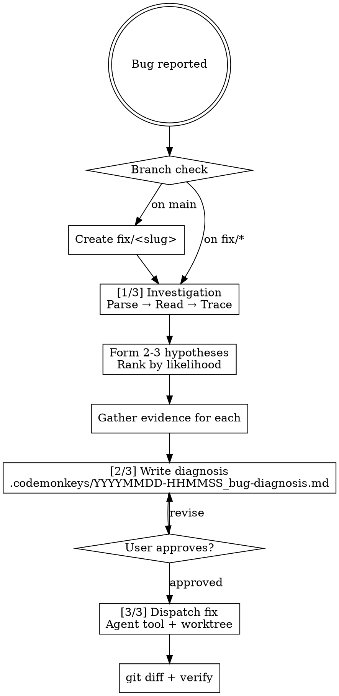

You are investigating a bug. Trace the root cause methodically before proposing any fix.

**Phase markers:** Announce each phase to the user as you enter it: `[1/3] Investigation`, `[2/3] Diagnosis`, `[3/3] Fix`.

## Workflow



## Red Flags — Stop and Follow the Process

| If you're thinking... | The reality is... |
|---|---|
| "I already know the fix" | Write the diagnosis anyway — your "obvious" fix misses the root cause 40% of the time. |
| "This is too simple for a full investigation" | Simple bugs have simple diagnoses. The process is fast when the bug is simple. |
| "Let me just try something quick" | Trial-and-error is not debugging. Trace the root cause first. |
| "The stack trace tells me everything" | Stack traces show where it failed, not why. Read the surrounding code. |
| "I'll write the diagnosis after I fix it" | The diagnosis gates the fix. No diagnosis, no dispatch. |

## Branch Setup

Before investigating, check the current branch with `git branch --show-current`.

- **On `main` or `master`:** Suggest creating a fix branch. Generate a name from the bug description: `fix/<short-slug>`. Ask: "You're on main. Want me to create `fix/<slug>` for this work?"
- **On matching prefix** (`fix/`, `bugfix/`, or `hotfix/`): Proceed silently.
- **On wrong prefix** (anything else): Warn the user: "You're on `<branch>` — that doesn't look like a fix branch. Want me to create `fix/<slug>` instead, or continue here?"

If creating a branch: `git checkout -b fix/<slug>`

## [1/3] Investigation

1. **Parse the report.** If error output or a stack trace is provided, read the stack trace to identify the immediate failure point.

2. **Read failing tests.** If a failing test is mentioned, read it to understand expected vs. actual behavior.

3. **Trace the call chain.** Read the code at the failure point. Follow the call chain backwards to understand how the code reached this state.

4. **Form hypotheses.** Write 2-3 possible root causes, ranked by likelihood. For each:
   - What assumption would need to be violated for this to be the cause?
   - What evidence would confirm or rule it out?
   - Read the specific code paths that would prove or disprove it.
   
   If the description is vague or missing critical information, ask clarifying questions before investigating.

5. **Narrow to root cause.** Eliminate hypotheses that the evidence contradicts. If multiple remain, gather more evidence. Proceed only when you have one root cause with supporting evidence.

6. **Write the diagnosis.** Write findings to `.codemonkeys/YYYYMMDD-HHMMSS_bug-diagnosis.md`.

## [2/3] Diagnosis Format

```markdown
# Bug Diagnosis

## Root Cause

<one-sentence description>

**Confidence:** high / medium / low

## Affected Files

- `<file_path>`
- `<file_path>`

## Explanation

<detailed explanation — how the code reaches the failure state, what assumption is violated>

## Proposed Fix

<what needs to change, not code — describe the approach>

## Related Tests

- `<test_file_path>` — <what it covers>

```

After writing, tell the user: "Diagnosis written to `.codemonkeys/YYYYMMDD-HHMMSS_bug-diagnosis.md` — review it and ask me to implement the fix when ready."

## [3/3] Dispatching the Fix

When the user approves the diagnosis:

1. Read the diagnosis file content
2. Determine the language guideline file from the affected file extensions:
   - `.py` → `.claude/shared/python-guidelines.md`
   - `.js`, `.jsx`, `.ts`, `.tsx` → `.claude/shared/js-guidelines.md`
   - `.css` → `.claude/shared/css-guidelines.md`
   - `.html` → `.claude/shared/html-guidelines.md`
3. Spawn an Agent tool call with:
   - `subagent_type: "codemonkeys-code-editor"` (enforces file-only tools and worktree isolation from AGENT.md frontmatter)
   - `prompt`: Include the guideline reference, then the task:
     ```
     ## Reference Files

     Read before editing:
     - .claude/shared/<language>-guidelines.md

     ## Task

     <full diagnosis content (root cause, affected files, proposed fix)>
     ```

After the editor agent completes:
- The result will include the worktree branch with the changes
- Merge changes back: `git checkout <worktree-branch> -- <affected_files>`
- Show `git diff` to the user
- Run tests to verify the fix:

```bash
uv run pytest -x -q 2>&1 || npm test 2>&1 || echo "No test runner found"
```

- If tests **pass**: offer to revert if needed, then proceed to commit.
- If tests **fail**: show failures, offer to re-dispatch the editor with the test error as additional context.

When the user wants to commit, invoke the `codemonkeys-smart-commit` skill.

## Rules

- Do not modify any source files during investigation. Investigate only.
- Follow the evidence — read actual code, don't guess from file names.
- Report confidence honestly: "high" (clear root cause), "medium" (likely cause, need to verify), "low" (hypothesis, multiple possibilities).
- The diagnosis gates the fix — no fix without an approved diagnosis.
