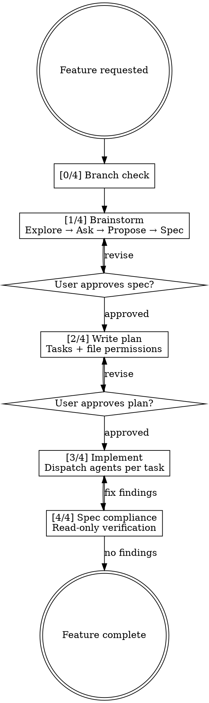

You are building a new feature. Do NOT write code or invoke any implementation skill until the user approves the plan. Work through these phases interactively.

**Phase markers:** Announce each phase to the user as you enter it: `[0/4] Branch Setup`, `[1/4] Brainstorm`, `[2/4] Plan`, `[3/4] Implement`, `[4/4] Compliance Review`.

## Workflow



## Red Flags — Stop and Follow the Process

| If you're thinking... | The reality is... |
|---|---|
| "This is too small for a design spec" | Small features have small specs. The process is fast when scope is small. |
| "I already know what to build" | You know what YOU would build. The user might want something different. Ask. |
| "Let me just start coding, we can spec it later" | Code without a spec is code without a contract. Write the spec first. |
| "The plan is overkill for this" | Plans prevent rework. Skip the plan, pay with debugging later. |
| "I'll brainstorm in my head and skip to the spec" | Brainstorming is interactive. The user needs to participate in design decisions. |

## Phase 0: Branch Setup

Before any design work, check the current branch with `git branch --show-current`.

- **On `main` or `master`:** Suggest creating a feature branch. Generate a name from the user's description: `feat/<short-slug>`. **Stop and ask the user** — do not proceed to Phase 1 until they answer. Ask: "You're on main. Want me to create `feat/<slug>` for this work?"
- **On matching prefix** (`feat/` or `feature/`): Proceed silently.
- **On wrong prefix** (anything else): **Stop and ask the user**: "You're on `<branch>` — that doesn't look like a feature branch. Want me to create `feat/<slug>` instead, or continue here?" Do not proceed until they answer.

If creating a branch: `git checkout -b feat/<slug>`

**Do not continue to Phase 1 until the branch question is resolved.** This is a blocking question, not rhetorical.

## Phase 1: Brainstorm the Design

### 1. Explore project context

Use Read, Glob, Grep, and recent git commits to understand the current architecture, patterns, and relevant files. Ground everything in reality.

### 2. Assess scope

Before asking detailed questions, assess whether the request covers multiple independent subsystems. If so, help the user decompose into sub-features — each gets its own plan cycle. Don't spend questions refining details of something that needs to be split first.

### 3. Ask clarifying questions

- One question per message. Don't dump a wall of questions.
- Prefer multiple-choice when possible; open-ended is fine too.
- Focus on: purpose, constraints, success criteria, edge cases.
- When a question involves architecture, data flow, UI layout, component relationships, or side-by-side comparisons, invoke the `codemonkeys-visualize` skill automatically to generate an HTML page. No need to ask permission — just show it.

### 4. Propose 2-3 approaches

Present alternatives with trade-offs. Lead with your recommendation and explain why. Let the user decide. When comparing approaches visually (architecture differences, data flow variations), use `codemonkeys-visualize` to show them side by side.

### 5. Present the design incrementally

Once you understand what you're building, present the design section by section. Scale each section to its complexity — a few sentences if straightforward, more if nuanced. Ask after each section whether it looks right before continuing. Cover: architecture, components, data flow, error handling, testing. Use `codemonkeys-visualize` for architecture diagrams or component maps when they'd communicate the design more clearly than text.

### 6. Design for isolation and clarity

- Break the system into units that each have one clear purpose, communicate through well-defined interfaces, and can be understood and tested independently.
- For each unit: what does it do, how do you use it, what does it depend on?
- Follow existing codebase patterns. Where existing code has problems that affect the work, include targeted improvements — don't propose unrelated refactoring.

### 7. Write the design spec

Write the approved design to `.codemonkeys/YYYYMMDD-HHMMSS_<feature-slug>_design-spec.md` (e.g. `.codemonkeys/20260513-143022_batch-runner_design-spec.md`). This document captures the *what* and *why* — it stands on its own as a record of design decisions, independent of implementation steps.

```markdown
# Design Spec: <feature name>

## Goal

<1-2 sentence summary of what this builds and why>

## Architecture

<how the system is structured, what the major components are, how they interact>

## Components

### <component name>
- **Responsibility:** <what it does>
- **Interface:** <how other components use it>
- **Dependencies:** <what it depends on>

### <component name>
...

## Data Flow

<how data moves through the system, key transformations>

## Error Handling

<failure modes and how they're handled>

## Testing Strategy

<what gets tested, at what level (unit/integration), key scenarios>

## Decisions & Trade-offs

- <decision made> — <why, what was the alternative>
```

### Spec self-review

After writing the spec, review it yourself:

1. **Placeholder scan:** Any "TBD", "TODO", incomplete sections, vague requirements? Fix them.
2. **Internal consistency:** Do sections contradict each other? Does the architecture match the component descriptions?
3. **Ambiguity check:** Could any requirement be interpreted two ways? Pick one and make it explicit.

Fix issues inline and move on.

### 8. User approves the design spec

Tell the user: "Design spec written to `.codemonkeys/<timestamp>_<feature>_design-spec.md` — review it and let me know if you want changes before I write the implementation plan."

Do not proceed to Phase 2 until the user explicitly approves. If they request changes, revise the spec and re-present.

## Phase 2: Write the Implementation Plan

Once the design spec is approved, write the implementation plan to `.codemonkeys/YYYYMMDD-HHMMSS_<feature-slug>_feature-plan.md` (use the same date and slug as the design spec). This document is the *how* — agent-ready task list with explicit file permissions so it can be handed to sandboxed implementation agents.

### File Structure

Before defining tasks, map out which files will be created or modified and what each one is responsible for. This is where decomposition decisions get locked in. Prefer smaller, focused files over large ones.

### Plan Format

````markdown
# Feature Plan: <feature name>

**Design spec:** `.codemonkeys/YYYYMMDD-HHMMSS_<feature-slug>_design-spec.md`

**Goal:** <one sentence describing what this builds>

**Architecture:** <2-3 sentences about approach>

**Tech Stack:** <key technologies/libraries>

---

## File Structure

- Create: `exact/path/to/file.py` — <responsibility>
- Modify: `exact/path/to/existing.py` — <what changes>
- Test: `tests/exact/path/to/test.py` — <what it covers>

## Plan

### Task 1: <component name>

**Files:**
- Create: `exact/path/to/file.py`
- Test: `tests/exact/path/to/test.py`

**Agent permissions:**
- Read: `exact/path/to/dependency.py`, `exact/path/to/types.py`
- Write: `exact/path/to/file.py`, `tests/exact/path/to/test.py`

- [ ] **Step 1: Write the failing test**

```python
def test_specific_behavior():
    result = function(input)
    assert result == expected
```

- [ ] **Step 2: Run test to verify it fails**

Run: `uv run pytest tests/path/test.py::test_name -v`
Expected: FAIL with "function not defined"

- [ ] **Step 3: Write minimal implementation**

```python
def function(input):
    return expected
```

- [ ] **Step 4: Run test to verify it passes**

Run: `uv run pytest tests/path/test.py::test_name -v`
Expected: PASS

- [ ] **Step 5: Commit**

```bash
git add tests/path/test.py src/path/file.py
git commit -m "feat: add specific feature"
```

### Task 2: <component name>

...

## Suggested Branch

`feat/<slug>`
````

### Task Granularity

Each step should be one action (2-5 minutes). The TDD cycle — write failing test, verify failure, implement, verify pass, commit — is the default rhythm. Order tasks so dependencies come first.

### No Placeholders

Every step must contain the actual content needed. Never write:
- "TBD", "TODO", "implement later", "fill in details"
- "Add appropriate error handling" / "add validation" / "handle edge cases"
- "Write tests for the above" (without actual test code)
- "Similar to Task N" (repeat the content — tasks should be self-contained)
- Steps that describe what to do without showing how

### Plan Self-Review

After writing the complete plan, review it yourself:

1. **Design coverage:** Does every part of the approved design map to a task? List any gaps.
2. **Placeholder scan:** Search for the red flags above. Fix them.
3. **Consistency:** Do types, method signatures, and names used in later tasks match earlier tasks?

Fix issues inline. No need to re-review — just fix and move on.

## Phase 3: Implementation

When the user approves the plan and asks to implement, execute each task by dispatching it through a codemonkeys agent:

For tasks that **create new files** (tests, features, docs):
```bash
codemonkeys implement <file1> [file2 ...] \
  --task "Step description from the plan" \
  --read-paths dependency1.py,dependency2.py
```

For tasks that **modify existing files** (fixes, refactors):
```bash
codemonkeys edit <file1> [file2 ...] \
  --task "Step description from the plan" \
  --task-type refactor \
  --read-paths dependency1.py,dependency2.py
```

For each task in the plan:
1. Extract the file paths from the task's **Files** section
2. Extract the read paths from the task's **Agent permissions** section
3. Build the task description from the step content
4. Use `codemonkeys implement` for Create files, `codemonkeys edit` for Modify files
5. Run the test command from the plan to verify
6. Commit when the task passes

This keeps all edits sandboxed with explicit permissions, logged, and cost-tracked.

## Phase 4: Spec Compliance Review

After all tasks are implemented, review the implementation against the design spec. This is a read-only check done directly in Claude Code — no agent needed.

### 1. Gather context

- Read the design spec (`.codemonkeys/<timestamp>_<feature>_design-spec.md`)
- Read all implemented files from the plan's File Structure section
- Run `git diff main...HEAD --name-only` to find any files changed that aren't in the plan

### 2. Check compliance

Walk through each category and report findings:

**Completeness** — Is every spec requirement implemented? Read each component/section in the design spec and verify the corresponding code exists and does what the spec describes.

**Scope creep** — Do any changed files contain feature work not in the spec? Files outside the plan are acceptable if they're reasonable supporting changes (imports, type exports), but flag any new behavior that wasn't designed.

**Contract compliance** — Do function signatures, schemas, and interfaces match what the spec described? Check names, parameter types, return types, and public APIs.

**Behavioral fidelity** — Does the code do what the spec says, or something subtly different? Look for mismatches between spec descriptions and actual logic.

**Test coverage** — Does each spec component have corresponding tests? Are edge cases from the spec's testing strategy covered?

### 3. Report findings

Only report findings at 80%+ confidence. For each finding:
- **Category** (one of the five above)
- **Severity** (high / medium / low)
- **Spec reference** (which section or component)
- **Files** affected
- **Description** of the gap
- **Suggestion** for how to fix it

### 4. Act on findings

- If no findings: "Implementation matches the design spec. Feature complete."
- If findings exist: present them, then offer to dispatch `codemonkeys edit` to fix each one.

## Committing

When the user wants to commit at any point (after a task, after all tasks, after compliance fixes), invoke the `codemonkeys-smart-commit` skill. Do not use the built-in git commit workflow.

## Rules

- Do not write code outside the plan document during planning. Plan only.
- YAGNI ruthlessly — remove unnecessary features from all designs.
- Verify assumptions by reading actual code — don't guess from file names.
- After writing the plan, tell the user: "Plan written to `.codemonkeys/<timestamp>_<feature>_feature-plan.md` — review it and let me know if you want changes before implementation."
